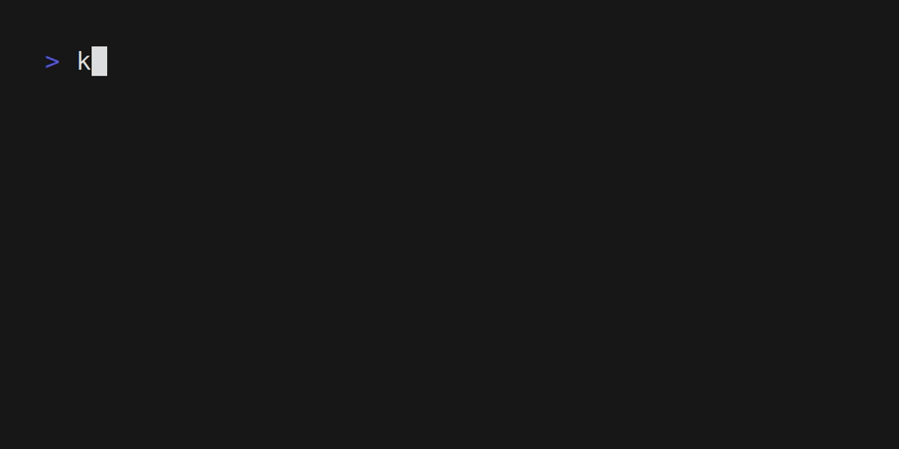
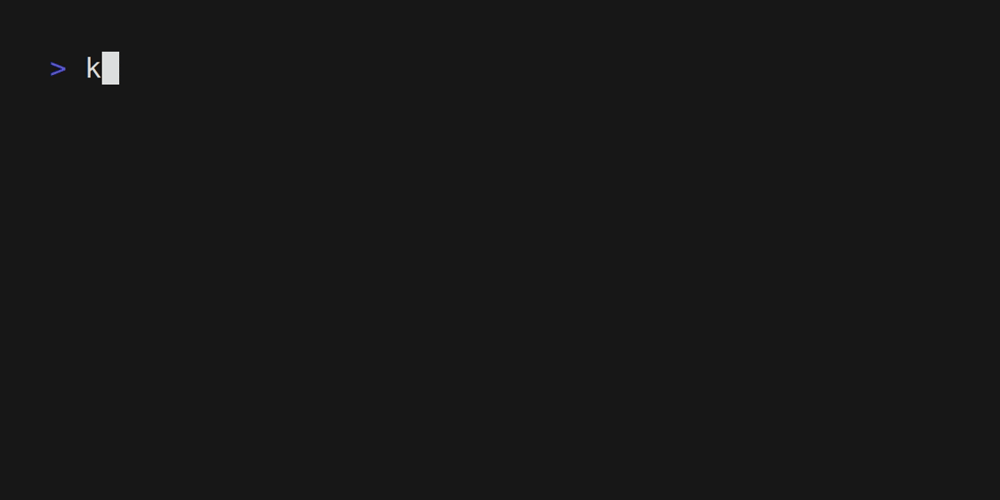

# Tekton Demo

## Prerequisites

You need a Kubernetes cluster and `kubectl` configured to use it.

create docker registry secret

```bash
REGISTRY_SERVER=https://index.docker.io/v1/ REGISTRY_USER=<your_registry_user> REGISTRY_PASSWORD=<your_registry_password>
kubectl create secret docker-registry push-secret \
    --docker-server=$REGISTRY_SERVER \
    --docker-username=$REGISTRY_USER \
    --docker-password=$REGISTRY_PASSWORD  \
    --docker-email=<your_email>
```

## Installatin

```bash
kubectl apply --filename https://storage.googleapis.com/tekton-releases/pipeline/previous/v0.50.5/release.yaml
```

## Shipwright

Shipwright

- 在k8s中构建容器镜像的Tekton可扩展框架。
- 支持流行的工具，如`Buildah`，`Clould Native Buildpacks`，以及`kaniko`。它使用`k8s`-style APIs。

### Installation

```bash
kubectl apply --filename https://github.com/shipwright-io/build/releases/download/v0.13.0/release.yaml --server-side
curl --silent --location https://raw.githubusercontent.com/shipwright-io/build/v0.13.0/hack/setup-webhook-cert.sh | bash
curl --silent --location https://raw.githubusercontent.com/shipwright-io/build/main/hack/storage-version-migration.sh | bash
```

Install Shipwright strategies

```bash
kubectl apply --filename https://github.com/shipwright-io/build/releases/download/v0.13.0/sample-strategies.yaml --server-side
```

check the types of `ClusterBuildStrategy`

```bash
kubectl get cbs
```



### Build Image

```bash
kubectl apply -f ./build-kaniko.yaml
kubectl get builds
```


For now, our `Build` is `Registered`  but not `Started` yet.

```bash
kubectl create -f ./buildrun-kaniko.yaml
```



Can check the image in dockerhub
- https://hub.docker.com/repositories/meirongdev